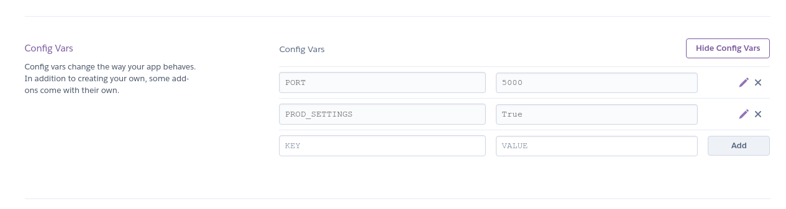

# DJANGO HEROKU DEPLOY

Aplicación Web con Django Framework, configurado para ser desplegado de forma local y de forma productiva sobre heroku.

# ¿Qué es Heroku?

Heroku es un servicio PaaS (Plataforma como servicio) lo que permite poseer herramientas de software y hardware preconfiguradas
con la finalidad de desplegar y publicar aplicaciones web personalizadas.

# Configuración

Se realiza configuración de settings y wsgi, generando un settings-prod y wsgi-prod con la finalidad de poseer configuraciones para despliegue local y despliegue sobre heroku. A continuación se explicará con más detalle las configuraciones realizadas.

A diferencia del entorno local o de desarrollo, heroku posee una configuración distinta para el despliegue. La primera diferencia sustancial que podemos mencionar es el servidor de aplicaciones en donde se desplegará nuestra aplicación web. Si accedemos a la [documentación en la página oficial de Django](https://docs.djangoproject.com/en/dev/ref/django-admin/#runserver) se menciona que el servidor por defecto que posee este framework solo esta disponible para programar (de forma local) y que si se desea pasar a un ambiente productivo este no debe ser ocupado, ya que no ha pasado pruebas de auditoria, rendimiento y seguridad. Además señalan que por ser su negocio el de generar un framework de python web y no la de crear un servidor de aplicaciones web, esto seguira siendo de esta forma.

Debido a lo antes mencionado, existen diversas soluciones de terceros que nos permiten desplegar nuestra aplicación web de forma productiva. El servidor que utilizaremos sobre heroku será gunicorn, posteriormente se mencionara como usar.

## Creación settings-prod y wsgi-prod

Para diferenciar configuraciones productivas y de desarrollo, se poseen diversos mecánismos. En este proyecto se eligió la utilización de archivos totalmente independientes para los despliegues, esta verificación se realiza mediante una variable de entorno llamada **PROD_SETTINGS**, que es verificada en el archivo **manage.py**. Dicha variable debe existir y poseer el valor igual a **True**, en caso contrario solo se utilizaran los archivos **settings.py** y **wsgi.py** que posee por defecto el proyecto al ser creado con los comando de Django.


## Configuración manage.py

El archivo **manage.py** es el que posee la configuración de la ruta y el nombre del archivo que será usado en la configuración de nuestro proyecto Django en su despliegue. Para este caso definiremos una regla que permita verificar si existe una variable de entorno que definirá si se utilizará el **settings.py** por defecto o se utilizará el **settings.prod**. Lo antes mencionado se observa en las siguientes líneas:

**manage.py**
```
    prod_settings = os.environ.get('PROD_SETTINGS')
    print('PROD_SETTINGS: '.format(prod_settings))

    if prod_settings and prod_settings == 'True':
        print('LOAD PROD SETTINGS')
        os.environ.setdefault('DJANGO_SETTINGS_MODULE','django_heroku_deploy.settings-prod')
    else:
        print('LOAD DEVELOPMENT SETTINGS')
        os.environ.setdefault('DJANGO_SETTINGS_MODULE', 'django_heroku_deploy.settings')
```

## Creación settings-prod y wsgi-prod

En esta sección explicaremos de forma breve el como se creo el archivo **settings.prod.py** y **wsgi-prod.py**, junto a las consideraciones que debemos tener.

Para crear el archivo **settings-prod.py** se realizaron las consideraciones pertinentes según la [documentación de heroku y Django](https://devcenter.heroku.com/categories/working-with-django). El primer paso es crear una copia del archivo settings.py que poseemos de forma local con el nombre **settings-prod.py**.

Posteriormente realizaremos las siguientes modificaciones:

1- Agregar librería django_heroku, línea 16 settings-prod.py.

```
import django_heroku
```

2- Configuramos mode debug en **falso** y agregamos el dominio que se genero para nuestra aplicación en heroku, junto a la ip **127.0.0.1**, línea 28 settings-prod.py.

```
DEBUG = False

ALLOWED_HOSTS = ['django-hekoru-deploy.herokuapp.com', '127.0.0.1']
```

**NOTA:** El valor del dominio heroku aparece en la sección **SETTINGS**.


3- Configuramos carpeta static para que sea desplegada en heroku, línea 125 settings-prod.py.

```
STATIC_ROOT = os.path.join(BASE_DIR, 'staticfiles')
STATIC_URL = '/static/'

STATICFILES_STORAGE = 'whitenoise.storage.CompressedManifestStaticFilesStorage'
```

4- Agregamos al final del archivo settings-prod.py la siguiente función de la libreria de heroku.

```
django_heroku.settings(locals())
```

5- Para crear el archivo **wsgi-prod.py** que será usado por el servidor gunicorn para desplegar la aplicación web, copiaremos el archivo **wsgi.py** con el nombre **wsgi-prod.py** y luego modificamos la línea 14, en donde se define que archivo settins se utilizara.

```
os.environ.setdefault('DJANGO_SETTINGS_MODULE','django_heroku_deploy.settings-prod')
```

## Creación archivo Procfile

Para el despliegue heroku nos da la posibilidad de indicar el servidor de aplicaciones y el comando de ejecución de la aplicación. Creamos entonces en el directorio raíz el archivo **Procfile** (sin extensión) con el siguiente contenido.

```
web: gunicorn django_heroku_deploy.wsgi-prod --log-level debug
```

**NOTA:** El comando indica el tipo de aplicación que se desplegará (web), el nombre del servidor (gunicorn), el nombre del archivo que posee la configuración de la aplicación a desplegar (django_heroku_deploy.wsgi-prod), configuración del nivel de logs que se mostrará en heroku.


## Creación archivo requirements.txt

Se debe crear archivo **requirements.txt** que define las dependencias de librerías a instalar en heroku. Para ellos ejecutaremos el siguiente comando.

```
python -m pip freeze > requirements.txt
```

**NOTA**: Usar entorno virtual env para desarrollar con la finalidad de no definir librerías que no se utilizarán al momento de desplegar nuestra aplicación.


El contenido para el archivo para este proyecto es el siguiente:

**requirements.txt**

```
asgiref==3.4.1
dj-database-url==0.5.0
Django==3.2.5
django-heroku==0.3.1
gunicorn==20.1.0
psycopg2==2.9.1
pytz==2021.1
sqlparse==0.4.1
whitenoise==5.2.0
```

## Creación archivo runtime.txt

Heroku nos permite definir que versión de python será usada en el despliegue de nuestra aplicación, para ellos se debe generar en el directorio raíz del proyecto el archivo **runtime.txt** con la siguiente información:

```
python-3.9.6
```
## Configuración de variable de entorno en heroku

Para desplegar en heroku debemos configurar las siguientes variables de entorno dentro de la aplicación en la sección **Settings**.



**NOTA:** La variable de entorno **PORT** debe estar en el valor **5000**, ya que en heroku las aplicaciones web son configuradas mediante este puerto para posteriormente exponerlas por el puerto **80/443**.

## App Desplegada

https://django-hekoru-deploy.herokuapp.com/

